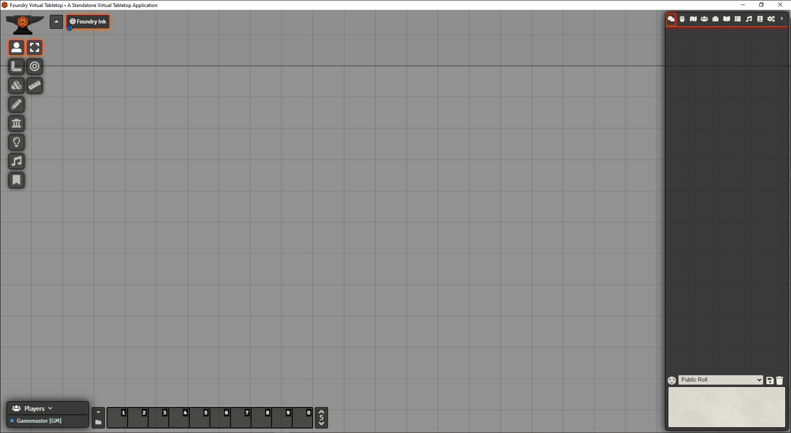

# Ink in the Foundry, AKA foundry-ink
This project ports a scripting language for interactive fiction into foundry!<br/>

<p align="center"></p><br>

Using the power of the ink scripting language, you can make interactive multimedia stories for FoundryVTT.

Currently, the module supports these features:

* Loading compiled stories written in ink
* Interacting with the story in chat or console (toggle via module settings)
* Accessing Foundry directly from your ink script using the functions `ROLL`, `ACTOR`, and `MACRO`
* [Online Documentation on github.io](https://aaronlip.github.io/foundry-ink/)

There is still much work to do, which is why this is **version 0**.

## How can I test this?
A `.json` for "The Intercept" is provided at `/modules/ink-files/intercept.json` for testing purposes. You can run it using this macro: 
```javascript
await FoundryInk.continueSession({
    sourcefile: '/modules/foundry-ink/ink-files/intercept.json',
    state: null,
    visited: false
});
```

<p align="center"></p>

To compile new `.json` files, use the [inky editor](https://github.com/inkle/inky) (version 0.12.0), write a file using the [ink language](https://github.com/inkle/ink/blob/master/Documentation/WritingWithInk.md), and then "export as JSON". Alternatively, you may use the backend of inky, the `inklecate` compiler.
## What is this?
This is a proof of concept wrapper library for [`inkjs`](https://github.com/y-lohse/inkjs), the javascript runtime for inkle's ink language.

[Ink](https://github.com/inkle/ink) is the MIT-licensed scripting language used to create interactive stories of many different sizes. Because the runtime is light-weight, it has been ported to [Unity](https://github.com/inkle/ink-unity-integration), [Unreal](https://github.com/DavidColson/UnrealInk), [npm](https://github.com/y-lohse/inkjs), and [Godot](https://github.com/paulloz/godot-ink).

Some example uses of the ink runtime include:

* [I Would Like to Go Home](https://elenatchi.itch.io/i-would-like-to-go-home), a short interactive about being a Mars exploration unit with only 4.9% battery power left. Playable in your browser.
* inkle's own [Heaven's Vault](https://store.steampowered.com/app/774201/Heavens_Vault/), a nonlinear game about archaeology, ruins, language, and the secret of Heaven's Vault.
* More can be  found in the [ink-library](https://github.com/inkle/ink-library#ink-games-and-non-games)

## What are the current features?
This project contains:

* An embedded `inkjs` interpreter
* Wrappers to interact with stories in chat or in the console. (You can switch them in module settings)
* External function bindings so that you can use a variety of foundry features in your ink script

<p align="center"></p>
